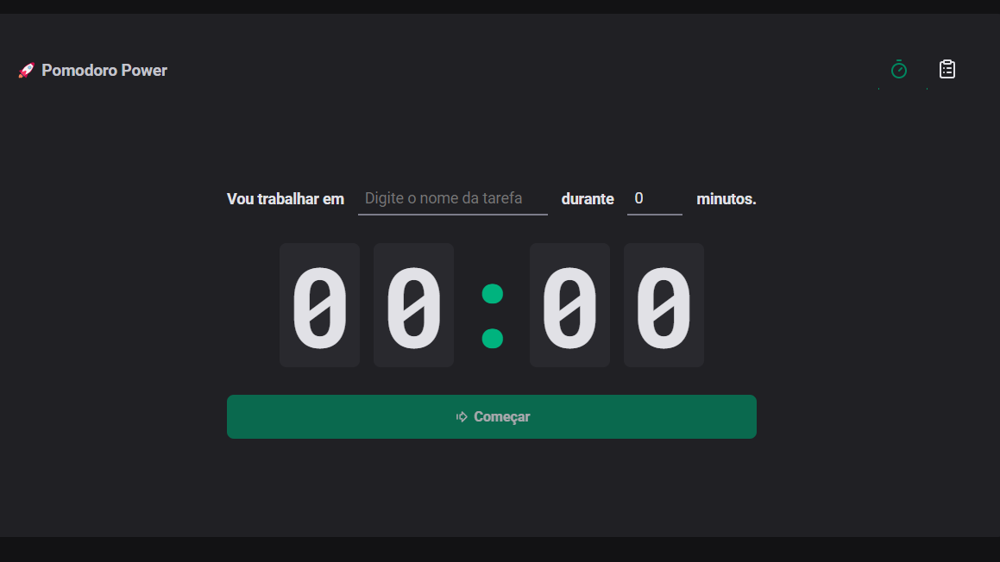

# React Pomodoro

## A aplicativo de Pomodoro desenvolvido utilizando React com TypeScript.

Ele possui duas páginas principais: uma para iniciar um ciclo Pomodoro e outra para visualizar o histórico de sessões.

### Utilizei

- Styled Components para estilização.

- React Router para navegação entre as páginas.

- Context API e reducers para gerenciamento de estado complexo.

- Immer para garantir imutabilidade dos dados.

- Zod para validação de entrada.

- e utilizei o localStorage para armazenar o conteúdo localmente.

Se precisar de mais detalhes ou ajuda com alguma parte específica do projeto, é só me avisar!

LinkedIn: [Douglas Borges ](https://www.linkedin.com/in/douglassborges/)

## para inicar o projeto

- fazer o git clone.
- depois de clonar entrar na pasta do projeto.
- abrir o terminal de comando e digitar <code> npm install </code> para instalar as dependencias.
- depois <code>npm run dev </code>

### observação

Além disso, fiz questão de adicionar comentários ao longo do código para que eu possa acompanhar como o projeto evoluiu desde o início até o final.

Isso me ajuda a manter tudo organizado e bem documentado.
